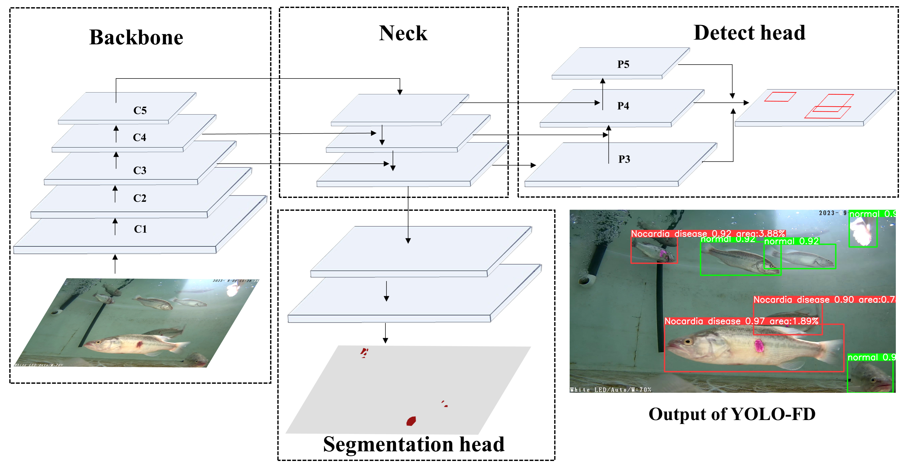

<div align="center">
<h2> YOLO-FD: An accurate fish disease detection method based on
multi-task learning </h2>
<div><a href="https://www.sciencedirect.com/science/article/pii/S0957417424019523">[paper source link]</a></div>
</div>

## Update
* `November 20, 2024`: Updated and improved the readme file.

## Introduction
we present YOLO-FD, a multi-task learning network specifically designed for simultaneous detection and segmentation.
YOLO-FD extends the YOLOv8 backbone by integrating a novel semantic segmentation branch dedicated to precisely segmenting infected areas in diseased fish, 
while retaining the original object detection branch for identifying infected fish.
The main contributions of **YOLO-FD**  are as follows:
*	**Integrating a novel semantic segmentation branch into the YOLOv8 network**
*	**Proposing a multi-task learning network YOLO-FD for detection and segmentation**
*	**Weight uncertainty and PCGrad are employed to YOLO-FD**
*	**Achieving accurate fish disease detection and assessment of fish disease severity**


<div align="center"> <h4>The architecture of YOLO-FD </h4> </div>

### Experitment
We used the VOC2012 segmentation dataset and Nocardiosis fish dataset (For some reason, the dataset is not public.) 
as our datasets,and experiments are run on NVIDIA RTX 3060, The overall video effect is as shown in Visualization.

### Visualization
 

## Models
You can get the pretrained model from <a href="https://github.com/feifei-Lee/YOLO-FD/blob/main/yolo-fd.pt">here</a>.

## Quick Start
### Basic environment
```shell
Python3.8 
CUDA 11.8
torch 1.10
Ultralytics YOLOv8.0.117
```
```shell
pip install -r requirements.txt
```
### Train
First, prepare the dataset in the following format, 
where class_weights.cache is automatically generated during first train and is used to balance the class weights.
```
📁 norcardia_disease_fish  
├── 📁 det  
│   ├── 📁 images  
│   │   ├── 📁 train  
│   │   └── 📁 val  
│   ├── 📁 labels  
│   │   ├── 📁 train  
│   │   └──📁 val  
├── 📁 seg  
│   ├── 📁 images  
│   │   ├── 📁 train  
│   │   └── 📁 val  
│   ├── 📁 labels  
│   │   ├── 📁 train  
│   │   ├── 📁 val  
│   │   └── 📄 class_weights.cache  
```
Then add your own customized dataset yaml file in ultralytics/datasets, set your customized yaml file name in train.py.
Run the code.
```shell
python train.py
```
The same goes for predict and val.

### Demo Test

We provide two testing method.You can store the image or video.
And the test images and test videos are under the demo folder.
```shell
python predict.py
```

## License

YOLO-FD is released under the [MIT Licence](LICENSE).

## Citation
If you find YOLO-FD is useful in your research or applications, please consider giving us a star and citing it by the following BibTeX entry.
```bibtex
@article{YOLO-FD,
  title={YOLO-FD: an accurate fish disease detection method based on multi-task learning},
  author={Li, Xuefei and Zhao Shili and Chen, Chunlin and Cui, Hongwu and Li, Daoliang and Zhao, Ran},
  journal={Expert Systems With Applications},
  year={2024}
}
``` 
